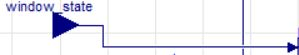
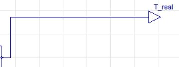

# DYMOLA-Python-connection-using-FMU
This script is a general guide to couple a DYMOLA simulation model with a Python script. This is mainly used when you want to make use of Deep/Machine learning in your simulation. The 'fmpy' library is used in this script, but there are also other libraries.

<table>
  <tr>
    <td align="center" style="vertical-align: top;">
        
      Caption for Image 1
    </td>
    <td align="center" style="vertical-align: top;">
        
      Caption for Image 2
    </td>
  </tr>
</table>

<table>
  <tr>
    <td align="center">
       
      DYMOLA Input module
    </td>
    <td align="center">
       
      DYMOLA Output module
    </td>
  </tr>
</table>

